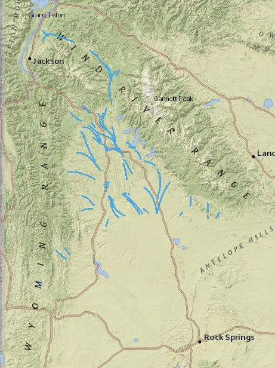
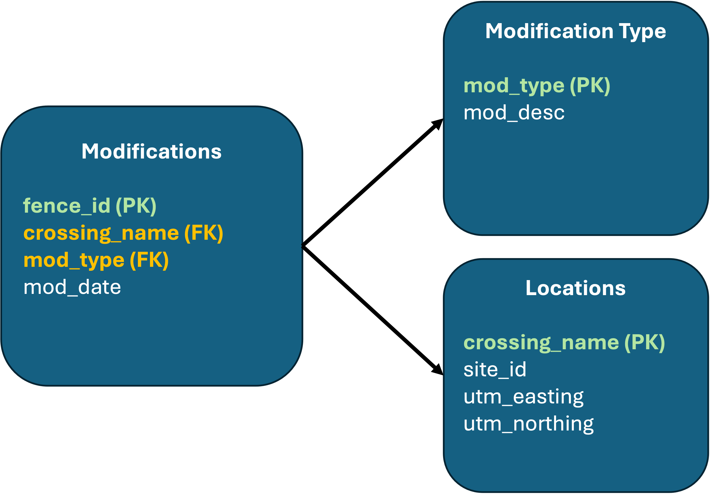

<br>

### Chapter 1: Pronghorn and Fences

Movement is essential to survival for pronghorn (*Antilocapra americana*), long-distance migratory ungulates that rely on seasonal movements to reach summer and winter ranges with adequate forage and milder conditions. Across the Greater Yellowstone Ecosystem, traditional livestock fencing on rangelands can restrict movement, increase energetic costs, and create hazards when animals crawl under or jump over wires, potentially fragmenting habitat and reducing population connectivity. In response, landowners and wildlife managers have begun modifying specific sections of fence to be more *wildlife-friendly* to improve passage for pronghorn and other wildlife, using strategies such as raising bottom wires, replacing barbed with smooth wire, and seasonally lowering fences during migration periods. Monitoring how pronghorn interact with these modified fences can help evaluate which designs are most effective at facilitating movement and reducing barriers across key habitats in the ecosystem. Questions are welcome — please contact [email](mailto:dayscottWild@gmail.com) Day D.T. Scott with any questions.

<center>

{width="70%"}

***Figure 1.1**: Pronghorn crossing fence in the Greater Yellowstone Ecosystem.*

</center>

<br>

#### 1.1 Institution

This research was conducted at the University of Idaho as part of a final project for WLF5530 - Reproducible Science.

<br>

#### 1.2 Study Area

This project focuses on fence modification sites within the Pinedale region of the Greater Yellowstone Ecosystem, where seasonal pronghorn movement often intersects with livestock fences.

<center>

{width="40%"}

***Figure 1.2**: Pronghorn migration routes (blue lines) across the Pinedale region of the Greater Yellowstone Ecosystem. Migration pathways shown represent major seasonal movements identified by wildlife researchers and management agencies.*

</center>

<br>

### Chapter 2: Database Creation

<br> Fence modification data were originally provided as a single Excel file containing information on locations, modification types, and individual modification events. While this format was sufficient for data collection, it resulted in repeated information and limited flexibility for structured analysis.

To improve data organization and reduce redundancy, a relational SQLite database was created following the entity–relationship diagram shown in Figure 2.1. The database consists of three related tables: locations, modification_types, and modifications. Separating the data into related tables improves data integrity, supports efficient querying, and facilitates reproducible data management.<br>

<center>{width="50%"}</center>

<br>

Figure 2.1. Entity–relationship diagram illustrating the structure of the SQLite database. The locations table stores spatial information for each fence crossing, the modification_types table contains standardized descriptions of fence modification types, and the modifications table links individual modification events to both location and modification type using foreign keys.

<br>

#### 2.1 Load required packages and data

This section loads the R packages required for data manipulation and database management and imports the original fence modification dataset from an Excel file. A brief check of column names is included to confirm successful data import and establish the structure of the raw data prior to database creation.

```{r load_data, message=FALSE, warning=FALSE}
library(readxl)
library(dplyr)
library(DBI)
library(RSQLite)

raw <- read_excel("fences.xlsx")

# quick check
names(raw)
```

<br>

#### 2.2 Create SQLite database and tables

In this section, a new SQLite database is created and structured according to the entity–relationship diagram shown in Figure 2.1. Three tables—locations, modification_types, and modifications—are defined with primary keys and foreign key relationships to ensure data integrity and formally represent relationships among fence locations, modification types, and modification events.

```{r}
con <- dbConnect(SQLite(), "pronghorn.db")

dbExecute(con, "
CREATE TABLE IF NOT EXISTS locations (
  crossing_name TEXT PRIMARY KEY,
  site_id TEXT,
  utm_easting REAL,
  utm_northing REAL
);
")

dbExecute(con, "
CREATE TABLE IF NOT EXISTS modification_types (
  mod_type TEXT PRIMARY KEY,
  mod_desc TEXT
);
")

dbExecute(con, "
CREATE TABLE IF NOT EXISTS modifications (
  fence_id TEXT PRIMARY KEY,
  crossing_name TEXT,
  mod_type TEXT,
  mod_date TEXT,
  FOREIGN KEY (crossing_name) REFERENCES locations(crossing_name),
  FOREIGN KEY (mod_type) REFERENCES modification_types(mod_type)
);
")

dbListTables(con)
```

<br>

#### 2.3 Create database tables in R

Here, the raw fence modification data are transformed into three separate R data frames corresponding to the database tables. Records are de-duplicated and filtered to remove missing key identifiers. This step ensures that each table contains only valid and unique entries prior to being written to the SQLite database.

```{r make_tables, message=FALSE, warning=FALSE}
library(dplyr)

# Table 1: locations
locations_df <- raw %>%
  select(crossing_name, site_id, utm_easting, utm_northing) %>%
  distinct() %>%
  filter(!is.na(crossing_name))

# Table 2: modification_types
mod_types_df <- raw %>%
  select(mod_type, mod_desc) %>%
  distinct() %>%
  filter(!is.na(mod_type))

# Table 3: modifications
modifications_df <- raw %>%
  select(fence_id, crossing_name, mod_type, mod_date) %>%
  distinct() %>%
  filter(!is.na(fence_id), !is.na(crossing_name), !is.na(mod_type))

# Verify the three tables were created
data.frame(
  table = c("locations_df", "mod_types_df", "modifications_df"),
  n_rows = c(nrow(locations_df), nrow(mod_types_df), nrow(modifications_df))
)
```

<br>

#### 2.4 Populate database tables

The prepared R data frames are written into the SQLite database tables using dbWriteTable(). After populating the database, row counts are queried and summarized to verify that all records were successfully written to each table.

```{r write_tables, message=FALSE, warning=FALSE}
library(DBI)
library(knitr)

# Write all three tables
dbWriteTable(con, "locations", locations_df, overwrite = TRUE)
dbWriteTable(con, "modification_types", mod_types_df, overwrite = TRUE)
dbWriteTable(con, "modifications", modifications_df, overwrite = TRUE)

# Verify row counts in SQLite
db_counts <- data.frame(
  table = c("locations", "modification_types", "modifications"),
  n_rows = c(
    dbGetQuery(con, "SELECT COUNT(*) AS n FROM locations;")$n,
    dbGetQuery(con, "SELECT COUNT(*) AS n FROM modification_types;")$n,
    dbGetQuery(con, "SELECT COUNT(*) AS n FROM modifications;")$n
  )
)

kable(db_counts, caption = "Table 2.1. Row counts for tables written to the pronghorn.db database.")
```

<br>

#### 2.5 Disconnect from database

After confirming that all tables were successfully created and populated, the database connection is closed to ensure proper resource management and to prevent unintended modifications during subsequent analyses.

```{r disconnect_db, include=FALSE}
dbDisconnect(con)
```

<br>

### Chapter 3: Data Wrangling and Exploration

<br>

#### **3.1 Data cleaning and standardization**

In this section, the raw fence modification data were cleaned and standardized to support consistent analysis. Modification descriptions contained inconsistent wording and missing values, which required consolidation into standardized categories. Missing modification descriptions were replaced with empty strings to prevent errors during pattern matching. Modification descriptions were then classified into a new categorical variable (mod_cat) representing major fence modification types: dropped or lowered wire, raised bottom wire, wildlife gate, or other. This standardization step reduces ambiguity in the raw text data and allows fence modifications to be summarized and compared consistently across sites.

```{r}
library(dplyr)
library(stringr)

raw_clean <- raw %>%
  mutate(
    mod_desc = coalesce(mod_desc, ""),
    mod_cat = case_when(
      # Dropped / lowered wire
      str_detect(mod_desc, regex("drop|lower|lowered|let\\s*down|lay\\s*down", ignore_case = TRUE)) ~
        "Dropped / lowered wire",

      # Raised bottom wire  ← OLD NAME RESTORED
      str_detect(mod_desc, regex("bottom\\s*wire|raise|raised|spacing|spaced|3\\s*-?\\s*wire|three\\s*-?\\s*wire", ignore_case = TRUE)) ~
        "Raised bottom wire",

      # Wildlife gate
      str_detect(mod_desc, regex("gate", ignore_case = TRUE)) ~
        "Wildlife gate",

      TRUE ~ "Other"
    )
  )

```

<br>

#### 3.2 Exploratory summaries / basic exploration

Exploratory summaries were used to identify major patterns in fence modification activity and to guide subsequent data visualization.First, the number of modification records was summarized by site to identify locations with the highest levels of fence modification activity. Second, modification descriptions were summarized to identify the most common types of fence modifications recorded in the dataset. Finally, unique modification type–description pairs were extracted to verify consistency between numeric modification codes and their associated descriptions. These summaries provide context for understanding where and how fence modifications are concentrated across the study area and inform the selection of visualizations presented in the following chapter.

```{r chapter3_exploration, message=FALSE, warning=FALSE}
library(dplyr)
library(knitr)

# Top 10 sites by number of modification records
top_sites_tbl <- raw %>%
  count(site_id, sort = TRUE) %>%
  slice_head(n = 10)

# Top 10 modification descriptions
top_mods_tbl <- raw %>%
  count(mod_desc, sort = TRUE) %>%
  slice_head(n = 10)

# Unique modification types and descriptions
mod_type_tbl <- raw %>%
  select(mod_type, mod_desc) %>%
  distinct() %>%
  arrange(mod_type)

top_sites_tbl
top_mods_tbl
mod_type_tbl
```

<br>

### Chapter 4: Data Visualization

This chapter visualizes patterns in fence modification records to describe where wildlife-friendly fence modifications are most common and which modification types occur across sites. These figures provide an overview of spatial concentration and modification practices within the dataset.


&nbsp;

#### 4.1 Sites with the most fence modifications
Figure 4.1 uses a bar chart created with ggplot2 to visualize the number of fence modification records across sites. This plot type is well suited for comparing counts among discrete locations and highlights the sites with the highest levels of modification activity. A small subset of sites accounts for a disproportionately large number of modifications, suggesting concentrated management or monitoring effort in these areas.

```{r plot_top_sites, message=FALSE, warning=FALSE, fig.cap="<b>Figure 4.1 </b>shows the ten sites with the highest number of recorded fence modification events. A small subset of sites accounts for a disproportionately large number of modifications, suggesting that monitoring and management efforts are concentrated in specific locations. These sites likely represent areas of frequent pronghorn movement or high management priority.", fig.align="center", fig.width=8, fig.height=5}
library(dplyr)
library(forcats)
library(ggplot2)

top_sites <- raw %>%
  filter(!is.na(site_id)) %>%
  count(site_id, sort = TRUE) %>%
  slice_head(n = 10) %>%
  mutate(site_id = fct_reorder(site_id, n))

ggplot(top_sites, aes(x = site_id, y = n, fill = site_id)) +
  geom_col(show.legend = FALSE) +
  coord_flip() +
  labs(
    title = "Sites with the highest number of fence modification records",
    x = NULL,
    y = "Number of modifications"
  ) +
  theme_minimal(base_size = 14) +
  theme(
    panel.grid.minor = element_blank(),
    plot.title = element_text(face = "bold")
  )
```
&nbsp;

#### 4.2 Wildlife-friendly fence modification types across top sites
Figure 4.2 uses a bubble plot created with ggplot2 to compare the occurrence of wildlife-friendly fence modification types across the ten sites with the most records. Bubble size represents the number of modification records, allowing differences in implementation frequency to be compared simultaneously across sites and modification types. This visualization highlights variation among sites in the use of dropped or lowered wires and wildlife gates.

```{r plot_site_mod_bubble, message=FALSE, warning=FALSE, fig.cap="<b>Figure 4.2</b> compares the occurrence of two wildlife-friendly fence modification types—dropped or lowered wires and wildlife gates—across the ten sites with the most modification records. Dropped or lowered wires are more frequently observed across sites, while wildlife gates occur less consistently and are concentrated at fewer locations. This pattern suggests that certain modification types may be easier to implement or more commonly applied across the study area.", fig.align="center", fig.width=8, fig.height=5}

library(dplyr)
library(ggplot2)

# Only the two categories that actually occur
keep_cats <- c(
  "Dropped / lowered wire",
  "Wildlife gate"
)

# Same top 10 sites as Figure 4.1
top10_sites <- raw %>%
  filter(!is.na(site_id)) %>%
  count(site_id, sort = TRUE) %>%
  slice_head(n = 10) %>%
  pull(site_id)

# Count real observations only
bubble_df <- raw_clean %>%
  filter(
    site_id %in% top10_sites,
    mod_cat %in% keep_cats
  ) %>%
  count(site_id, mod_cat, name = "n") %>%
  mutate(
    site_id = factor(site_id, levels = rev(top10_sites)),
    mod_cat = factor(mod_cat, levels = keep_cats),
    count_bin = case_when(
      n <= 10 ~ "10",
      n <= 15 ~ "15",
      TRUE    ~ "20"
    ),
    count_bin = factor(count_bin, levels = c("10", "15", "20"))
  )

ggplot(
  bubble_df,
  aes(x = mod_cat, y = site_id, size = count_bin, color = count_bin)
) +
  geom_point(alpha = 0.85) +
  scale_size_manual(
    values = c("10" = 5, "15" = 8, "20" = 11),
    name = "Record count"
  ) +
  scale_color_manual(
    values = c("10" = "#66C2A5", "15" = "#FC8D62", "20" = "#8DA0CB"),
    name = "Record count"
  ) +
  labs(
    title = "Wildlife-friendly fence modification types across sites",
    x = "Modification type",
    y = "Site (top 10)"
  ) +
  theme_minimal(base_size = 14) +
  theme(
    plot.title = element_text(face = "bold"),
    axis.text.x = element_text(angle = 0, hjust = 0.5),
    axis.text.y = element_text(size = 12),
    axis.title.x = element_text(margin = margin(t = 16)),
    axis.title.y = element_text(margin = margin(r = 14)),
    panel.grid.minor = element_blank()
  )
```
